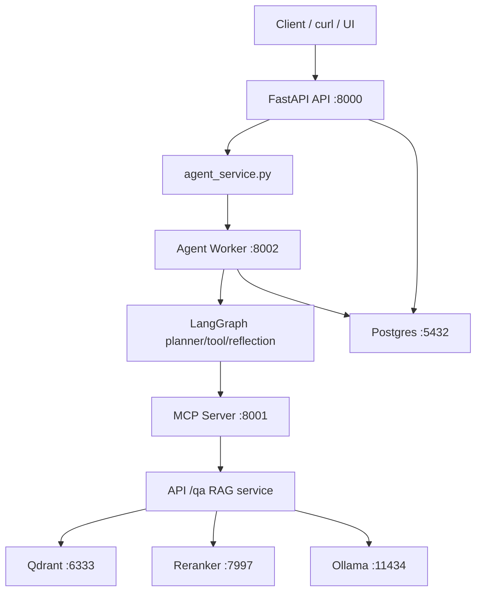
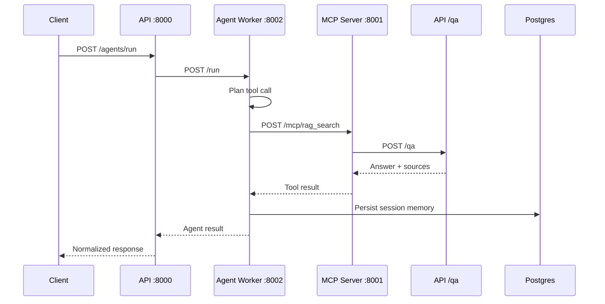
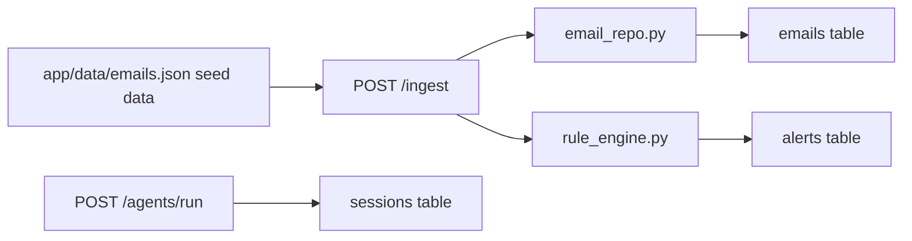
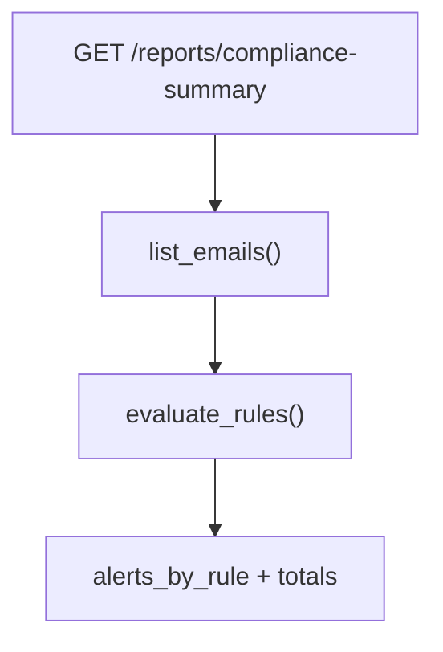

# Compliance Agent RAG - Architecture Diagrams

Last updated: May 9, 2026

## Service Topology

## Full Agent RAG Sequence

## Persistence Flow

## Report Flow

## Key Ports

| Service | Port |
| --- | --- |
| API | 8000 |
| MCP server | 8001 |
| Agent worker | 8002 |
| Postgres | 5432 |
| Qdrant | 6333 |
| Reranker | 7997 |
| Ollama | 11434 |
